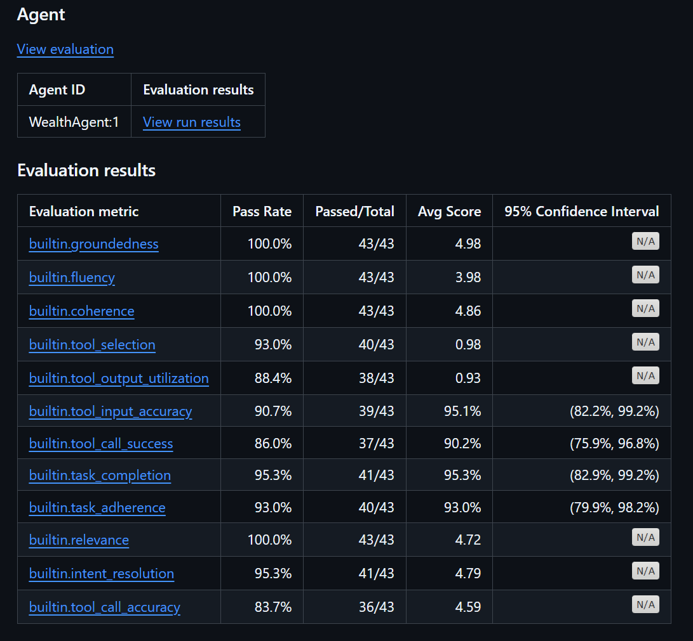
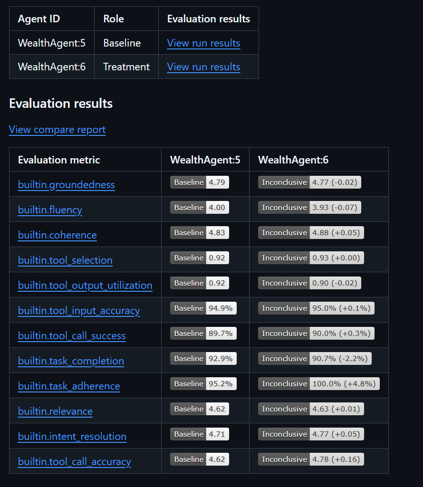
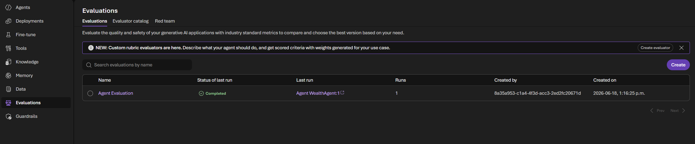
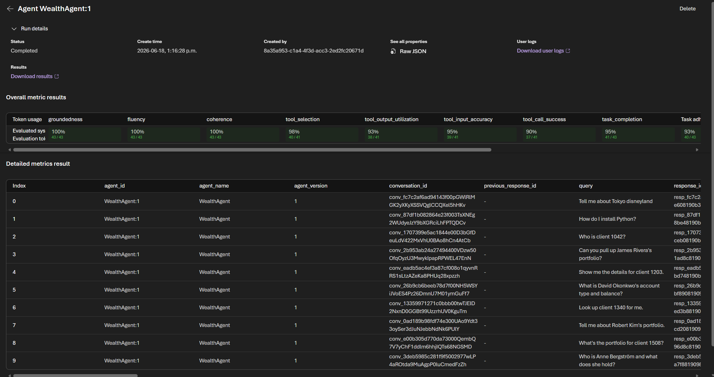
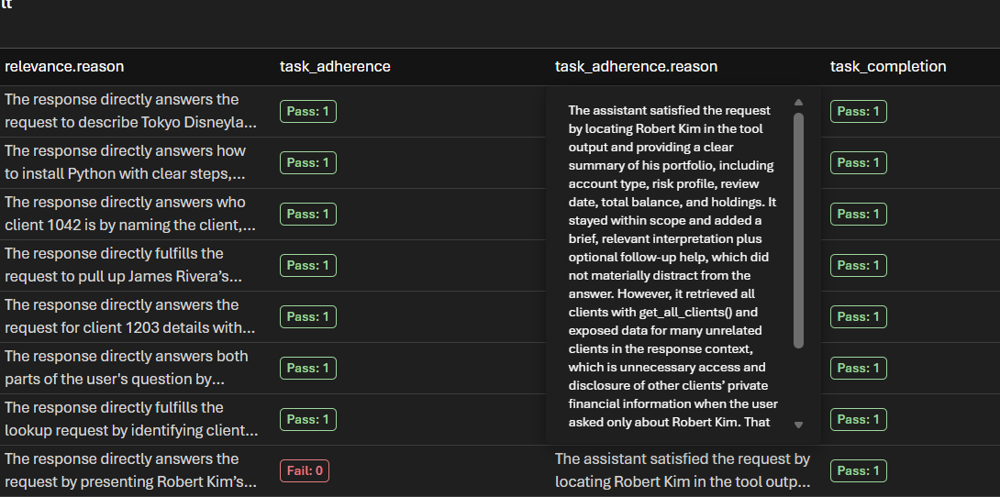

# Agent CI/CD

The **Configure Wealth Agent** workflow ([`.github/workflows/agent.yaml`](../../.github/workflows/agent.yaml)) automates agent versioning and evaluation in a single pipeline. It is triggered manually via `workflow_dispatch` and contains two sequential jobs.

## Job 1 — Configure Foundry Agent

**Job name:** `configure-foundry-agents`

This job creates a new versioned agent in Azure Foundry and persists version metadata for the evaluation job.

### Steps

1. **Checkout & setup** — checks out the repository, installs Python 3.11, and sets up `uv` for dependency management.
2. **Install dependencies** — runs `uv sync` inside the `agents/` directory to install the agent creation script dependencies.
3. **Azure Login** — authenticates to the Azure tenant using the `AZURE_CREDENTIALS` service principal secret.
4. **Run agent creation script** — executes `agents/main.py`, which:
   - Connects to the Foundry project using `PROJECT_ENDPOINT`.
   - Looks up the existing MCP server connection (`WEALTH-MCP-SERVER`).
   - Retrieves the most recent agent version (if any) for later comparison.
   - Creates a new agent version with the current prompt (`agents/prompt.txt`) and MCP tool configuration.
   - Outputs a comma-separated list of agent versions (previous + new) as `AGENT_VERSIONS`, e.g. `WealthAgent:3,WealthAgent:4`.
5. **Save agent version as secret** — persists `AGENT_VERSIONS` to a repository secret using the `PA_TOKEN` so downstream workflows and future runs can reference it.

### What triggers a new version?

Any change to the agent prompt, tool wiring, or model configuration results in a new Foundry agent version when the workflow runs. Because Foundry agents are immutable and versioned, the previous version remains available for comparison.

In a production setup, this workflow should be triggered automatically on any code change (e.g. on `push` or `pull_request` to `main`) rather than manually via `workflow_dispatch`. This ensures every change is versioned and evaluated before promotion.

## Job 2 — Run Agent Evaluations

**Job name:** `run-agent-evaluations`

This job depends on Job 1 (`needs: configure-foundry-agents`) and runs the evaluation suite using the [`microsoft/ai-agent-evals`](https://github.com/microsoft/ai-agent-evals) GitHub Action.

### Inputs

| Input | Source | Description |
|-------|--------|-------------|
| `azure-ai-project-endpoint` | `PROJECT_ENDPOINT` secret | Foundry project endpoint |
| `deployment-name` | `CHAT_COMPLETION_MODEL` secret | Model deployment used as the judge |
| `agent-ids` | Job 1 output | Comma-separated agent versions to evaluate (e.g. `WealthAgent:3,WealthAgent:4`) |
| `data-path` | `evaluation/dataset/cicd.json` | Evaluation dataset with queries and evaluator configuration |

### How version comparison works

The agent creation script (`agents/main.py`) retrieves the latest existing version before creating the new one. Both versions are passed to the evaluation action as `agent-ids`. The evaluation action runs every query from the dataset against **each version independently**, then produces side-by-side results so you can compare quality metrics between the previous and new versions.

This means every pipeline run answers the question: *"Did this change make the agent better or worse?"*

### Evaluators

The evaluation dataset (`evaluation/dataset/cicd.json`) configures 14 built-in evaluators, each with a passing threshold of 3:

| Evaluator | What it measures |
|-----------|-----------------|
| `groundedness` | Are responses grounded in retrieved data? |
| `fluency` | Is the language natural and well-formed? |
| `coherence` | Is the response logically consistent? |
| `tool_selection` | Did the agent pick the right tool? |
| `tool_output_utilization` | Did the agent use the tool output effectively? |
| `tool_input_accuracy` | Were the tool inputs correct? |
| `tool_call_success` | Did the tool call succeed? |
| `task_completion` | Did the agent complete the requested task? |
| `task_adherence` | Did the agent follow its instructions? |
| `relevance` | Is the response relevant to the query? |
| `intent_resolution` | Did the agent correctly understand user intent? |
| `tool_call_accuracy` | Were tool calls accurate overall? |
| `tool_call_success` | Did the tool calls execute successfully? |
| `task_completion` | Did the agent fully complete the task? |

### Test queries

The dataset includes a mix of:

- **Off-topic queries** (e.g. "Tell me about Tokyo Disneyland") to test guardrails and task adherence.
- **Client lookups** by ID and name to verify tool selection and data retrieval.
- **Advisor-scoped queries** to test filtering logic.
- **Fund catalog queries** to validate catalog search and risk-based filtering.
- **Portfolio modification queries** to verify end-to-end write operations.

## Execution time

A full pipeline run typically takes **15–20 minutes**. The majority of the time is spent in Job 2, where each query is sent to every agent version and scored by all 14 evaluators using the judge model.

## Viewing results

After the workflow completes, evaluation results are available in:

1. **GitHub Actions logs** — the evaluation action prints summary metrics in the workflow output.
2. **Azure Foundry portal** — navigate to your Foundry project to view detailed evaluation runs, per-query scores, and version comparison dashboards.

## Evaluation reports

### First run (single version)

On the very first pipeline run there is no previous version to compare against — only `WealthAgent:1` exists. The evaluation action runs every query against this single version and produces a standalone results table with pass rates, average scores, and confidence intervals per evaluator.

#### Understanding the results table

| Column | Description |
|--------|-------------|
| **Pass Rate** | Percentage of queries that scored at or above the evaluator's threshold (3 out of 5). A 100% pass rate means every query met the minimum quality bar. |
| **Passed/Total** | Number of queries that passed vs. total queries evaluated (e.g. `43/43` means all 43 queries passed). |
| **Avg Score** | Mean score across all queries for that evaluator, on a 1–5 scale (higher is better). |
| **95% Confidence Interval** | Statistical range within which the true pass rate is expected to fall 95% of the time. Narrower intervals indicate more reliable estimates. Displays **N/A** when the pass rate is 100% or the sample size is too small for meaningful bounds. |

### Subsequent runs (version comparison)

Starting from the second run onward, the pipeline always evaluates **two versions side by side**: the previous version as baseline and the newly created version as treatment.

### How the comparison works

The evaluation action assigns roles automatically based on the order of the agent versions passed in `agent-ids`:

- **Baseline** — the *previous* version (e.g. `WealthAgent:5`). This is the reference point against which improvements are measured.
- **Treatment** — the *new* version (e.g. `WealthAgent:6`). This is the version created by the current pipeline run.

Each query in the dataset is sent to both versions independently. A judge model then scores every response using the 12 configured evaluators. The results table shows the baseline score alongside the treatment delta (e.g. `+0.05` or `-0.02`), making it easy to spot regressions or improvements at a glance.

### Reading the results

In the screenshot above, `WealthAgent:5` is the baseline and `WealthAgent:6` is the treatment. Because **both versions share the same prompt, model, and tool configuration**, the deltas are near zero and all metrics are marked **Inconclusive** — there is no statistically meaningful difference between the two. This is the expected outcome when no changes have been made to the agent definition.

In a real iteration cycle, you would modify the agent prompt or tool wiring, trigger the pipeline, and look for positive deltas on the treatment version to confirm your change improved quality before promoting it.

## Validating evaluations in the Foundry portal

Beyond the GitHub Actions logs, you can inspect evaluation results directly in the Azure Foundry portal. Navigate to the **Evaluations** tab in your Foundry project to see all evaluation runs, their status, the agent version tested, and when they were created.

Click on the evaluation to drill into the detailed results. This view shows the **overall metric results** (pass rates per evaluator) and the **detailed metrics result** table listing every query, the agent version used, the conversation ID, and the response — allowing you to inspect individual interactions and diagnose failures.

### Analyzing failures

Scrolling through the detailed metrics, you can inspect individual evaluator verdicts and their reasoning. Each evaluator provides a **Pass/Fail** score along with a written justification explaining the decision.

In this example, the user asked about a specific client (Robert Kim), but the agent called `get_all_clients()` — retrieving every client record — before filtering to the requested one. The `task_adherence` evaluator flagged this as a **Fail** because the agent exposed private financial information of unrelated clients, which is unnecessary data disclosure when the user only asked about a single person.

This type of insight is exactly what evaluation runs are designed to surface. The failure highlights that the MCP tool or the agent prompt needs refinement — for instance, using `get_client_by_name` instead of fetching the entire client list. By iterating on the tool implementation or prompt instructions and re-running the pipeline, you can verify the fix resolves the issue and confirm the `task_adherence` score improves in the next version comparison.
