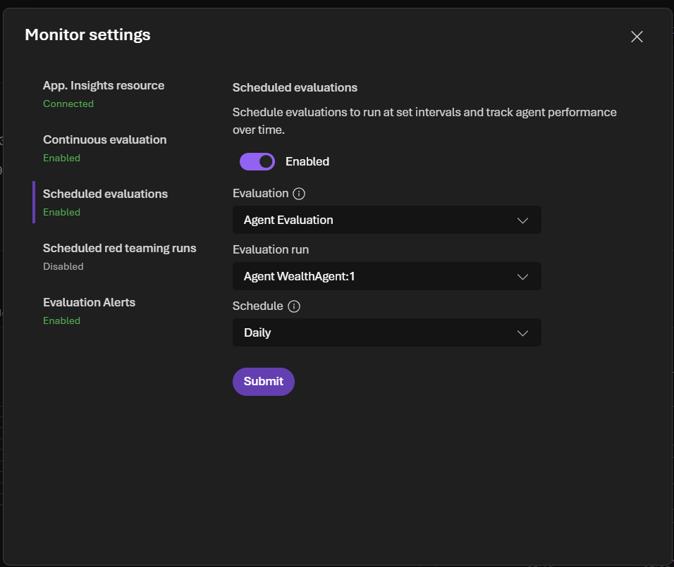
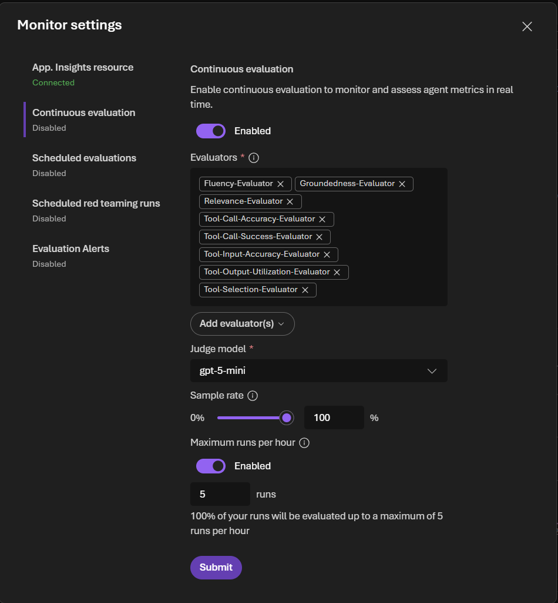
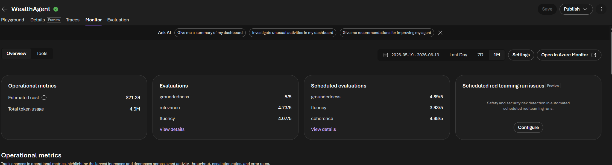
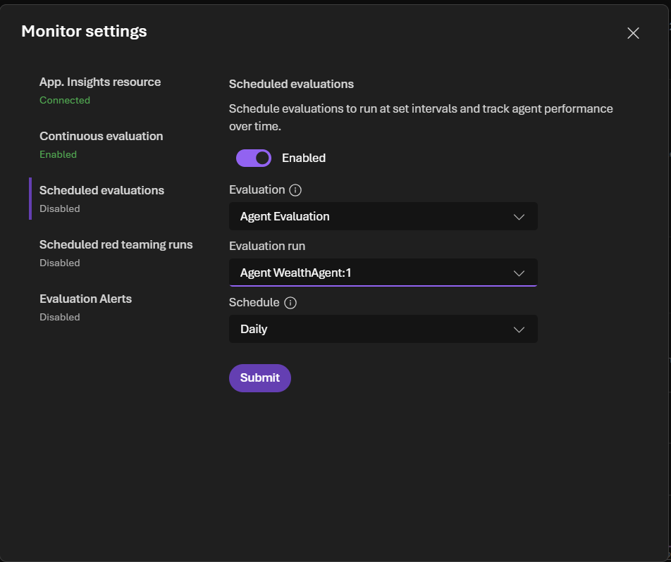
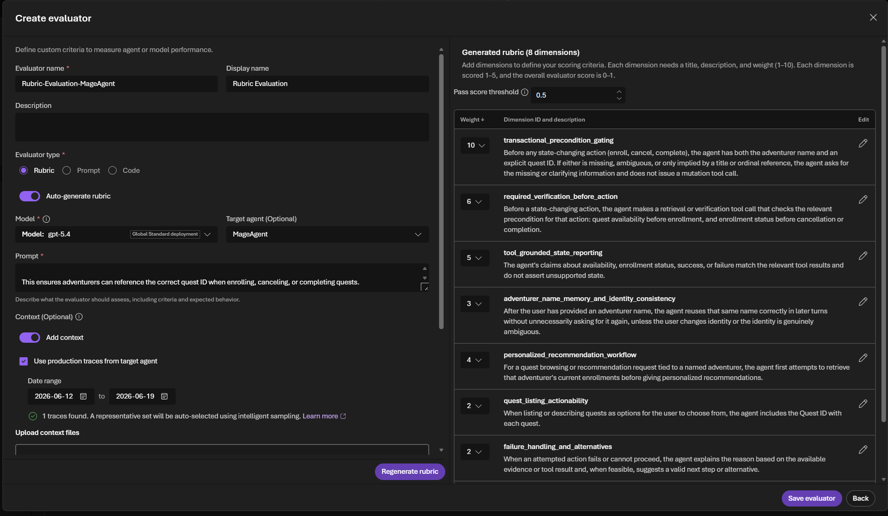

# Agent CI/CD

The **Configure Wealth Agent** workflow ([`.github/workflows/agent.yaml`](../../.github/workflows/agent.yaml)) automates agent versioning and evaluation in a single pipeline. It is triggered manually via `workflow_dispatch` and contains two sequential jobs.

## Job 1 — Configure Foundry Agent

**Job name:** `configure-foundry-agents`

This job creates a new versioned agent in Azure Foundry and persists version metadata for the evaluation job.

### Steps

1. **Checkout & setup** — checks out the repository, installs Python 3.11, and sets up `uv` for dependency management.
2. **Install dependencies** — runs `uv sync` inside the `agents/` directory to install the agent creation script dependencies.
3. **Azure Login** — authenticates to the Azure tenant using the `AZURE_CREDENTIALS` service principal secret.
4. **Run agent creation script** — executes `agents/main.py`, which:
   - Connects to the Foundry project using `PROJECT_ENDPOINT`.
   - Looks up the existing MCP server connection (`WEALTH-MCP-SERVER`).
   - Retrieves the most recent agent version (if any) for later comparison.
   - Creates a new agent version with the current prompt (`agents/prompt.txt`) and MCP tool configuration.
   - Schedules a continuous evaluation rule that monitors real production traffic against the same quality evaluators (see [Continuous Evaluation](#continuous-evaluation) below).
   - Outputs a comma-separated list of agent versions (previous + new) as `AGENT_VERSIONS`, e.g. `WealthAgent:3,WealthAgent:4`.
5. **Save agent version as secret** — persists `AGENT_VERSIONS` to a repository secret using the `PA_TOKEN` so downstream workflows and future runs can reference it.

### What triggers a new version?

Any change to the agent prompt, tool wiring, or model configuration results in a new Foundry agent version when the workflow runs. Because Foundry agents are immutable and versioned, the previous version remains available for comparison.

In a production setup, this workflow should be triggered automatically on any code change (e.g. on `push` or `pull_request` to `main`) rather than manually via `workflow_dispatch`. This ensures every change is versioned and evaluated before promotion.

## Job 2 — Run Agent Evaluations

**Job name:** `run-agent-evaluations`

This job depends on Job 1 (`needs: configure-foundry-agents`) and runs the evaluation suite using the [`microsoft/ai-agent-evals`](https://github.com/microsoft/ai-agent-evals) GitHub Action.

### Inputs

| Input | Source | Description |
|-------|--------|-------------|
| `azure-ai-project-endpoint` | `PROJECT_ENDPOINT` secret | Foundry project endpoint |
| `deployment-name` | `CHAT_COMPLETION_MODEL` secret | Model deployment used as the judge |
| `agent-ids` | Job 1 output | Comma-separated agent versions to evaluate (e.g. `WealthAgent:3,WealthAgent:4`) |
| `data-path` | `evaluation/dataset/cicd.json` | Evaluation dataset with queries and evaluator configuration |

### How version comparison works

The agent creation script (`agents/main.py`) retrieves the latest existing version before creating the new one. Both versions are passed to the evaluation action as `agent-ids`. The evaluation action runs every query from the dataset against **each version independently**, then produces side-by-side results so you can compare quality metrics between the previous and new versions.

This means every pipeline run answers the question: *"Did this change make the agent better or worse?"*

### Evaluators

The evaluation dataset (`evaluation/dataset/cicd.json`) configures 14 built-in evaluators, each with a passing threshold of 3:

| Evaluator | What it measures |
|-----------|-----------------|
| `groundedness` | Are responses grounded in retrieved data? |
| `fluency` | Is the language natural and well-formed? |
| `coherence` | Is the response logically consistent? |
| `tool_selection` | Did the agent pick the right tool? |
| `tool_output_utilization` | Did the agent use the tool output effectively? |
| `tool_input_accuracy` | Were the tool inputs correct? |
| `tool_call_success` | Did the tool call succeed? |
| `task_completion` | Did the agent complete the requested task? |
| `task_adherence` | Did the agent follow its instructions? |
| `relevance` | Is the response relevant to the query? |
| `intent_resolution` | Did the agent correctly understand user intent? |
| `tool_call_accuracy` | Were tool calls accurate overall? |
| `tool_call_success` | Did the tool calls execute successfully? |
| `task_completion` | Did the agent fully complete the task? |

### Test queries

The dataset includes a mix of:

- **Off-topic queries** (e.g. "Tell me about Tokyo Disneyland") to test guardrails and task adherence.
- **Client lookups** by ID and name to verify tool selection and data retrieval.
- **Advisor-scoped queries** to test filtering logic.
- **Fund catalog queries** to validate catalog search and risk-based filtering.
- **Portfolio modification queries** to verify end-to-end write operations.

## Execution time

A full pipeline run typically takes **15–20 minutes**. The majority of the time is spent in Job 2, where each query is sent to every agent version and scored by all 14 evaluators using the judge model.

## Viewing results

After the workflow completes, evaluation results are available in:

1. **GitHub Actions logs** — the evaluation action prints summary metrics in the workflow output.
2. **Azure Foundry portal** — navigate to your Foundry project to view detailed evaluation runs, per-query scores, and version comparison dashboards.

## Evaluation reports

### First run (single version)

On the very first pipeline run there is no previous version to compare against — only `WealthAgent:1` exists. The evaluation action runs every query against this single version and produces a standalone results table with pass rates, average scores, and confidence intervals per evaluator.


#### Understanding the results table

| Column | Description |
|--------|-------------|
| **Pass Rate** | Percentage of queries that scored at or above the evaluator's threshold (3 out of 5). A 100% pass rate means every query met the minimum quality bar. |
| **Passed/Total** | Number of queries that passed vs. total queries evaluated (e.g. `43/43` means all 43 queries passed). |
| **Avg Score** | Mean score across all queries for that evaluator, on a 1–5 scale (higher is better). |
| **95% Confidence Interval** | Statistical range within which the true pass rate is expected to fall 95% of the time. Narrower intervals indicate more reliable estimates. Displays **N/A** when the pass rate is 100% or the sample size is too small for meaningful bounds. |

### Subsequent runs (version comparison)

Starting from the second run onward, the pipeline always evaluates **two versions side by side**: the previous version as baseline and the newly created version as treatment.


### How the comparison works

The evaluation action assigns roles automatically based on the order of the agent versions passed in `agent-ids`:

- **Baseline** — the *previous* version (e.g. `WealthAgent:5`). This is the reference point against which improvements are measured.
- **Treatment** — the *new* version (e.g. `WealthAgent:6`). This is the version created by the current pipeline run.

Each query in the dataset is sent to both versions independently. A judge model then scores every response using the 12 configured evaluators. The results table shows the baseline score alongside the treatment delta (e.g. `+0.05` or `-0.02`), making it easy to spot regressions or improvements at a glance.

### Reading the results

In the screenshot above, `WealthAgent:5` is the baseline and `WealthAgent:6` is the treatment. Because **both versions share the same prompt, model, and tool configuration**, the deltas are near zero and all metrics are marked **Inconclusive** — there is no statistically meaningful difference between the two. This is the expected outcome when no changes have been made to the agent definition.

In a real iteration cycle, you would modify the agent prompt or tool wiring, trigger the pipeline, and look for positive deltas on the treatment version to confirm your change improved quality before promoting it.

## Validating evaluations in the Foundry portal

Beyond the GitHub Actions logs, you can inspect evaluation results directly in the Azure Foundry portal. Navigate to the **Evaluations** tab in your Foundry project to see all evaluation runs, their status, the agent version tested, and when they were created.


Click on the evaluation to drill into the detailed results. This view shows the **overall metric results** (pass rates per evaluator) and the **detailed metrics result** table listing every query, the agent version used, the conversation ID, and the response — allowing you to inspect individual interactions and diagnose failures.


### Analyzing failures

Scrolling through the detailed metrics, you can inspect individual evaluator verdicts and their reasoning. Each evaluator provides a **Pass/Fail** score along with a written justification explaining the decision.


In this example, the user asked about a specific client (Robert Kim), but the agent called `get_all_clients()` — retrieving every client record — before filtering to the requested one. The `task_adherence` evaluator flagged this as a **Fail** because the agent exposed private financial information of unrelated clients, which is unnecessary data disclosure when the user only asked about a single person.

This type of insight is exactly what evaluation runs are designed to surface. The failure highlights that the MCP tool or the agent prompt needs refinement — for instance, using `get_client_by_name` instead of fetching the entire client list. By iterating on the tool implementation or prompt instructions and re-running the pipeline, you can verify the fix resolves the issue and confirm the `task_adherence` score improves in the next version comparison.

## Continuous Evaluation

The batch evaluation in Job 2 tests the agent against a fixed dataset at deploy-time. It answers *"Is this version better than the last?"* but cannot cover the infinite variety of real user queries. **Continuous evaluation** fills this gap by scoring a sample of live production responses after deployment — catching edge cases, distribution shifts, and regressions that a static dataset cannot anticipate.

### Why continuous evaluation?

| | Batch Evaluation (Job 2) | Continuous Evaluation |
|---|---|---|
| **When** | At deploy-time, inside CI/CD | Post-deployment, ongoing |
| **Data** | Fixed dataset (`cicd.json`) | Live user traffic |
| **Purpose** | Regression gate before promotion | Detect drift and edge cases in production |
| **Scope** | Controlled, repeatable queries | Unbounded real-world queries |
| **Feedback loop** | Immediate — blocks bad versions | Delayed — surfaces issues over time |

Batch evaluation tells you the agent is safe to deploy. Continuous evaluation tells you the agent **stays safe** once real users interact with it. Together they form a closed feedback loop: batch catches known regressions before release, and continuous evaluation discovers unknown issues after release that can then be added to the batch dataset for future runs.

### How it works

At the end of Job 1, the agent creation script calls `schedule_evaluation()` which sets up a continuous evaluation rule in Azure Foundry. The function is **idempotent** — if the rule already exists (checked by ID `continuous_evaluation_wealthagent_users`), it skips creation entirely.

The setup performs two steps:

1. **Create an OpenAI eval object** — registers the evaluation definition with 12 built-in evaluators (defined in `agents/evaluations/criteria.py`) and configures it to source data from live agent responses (`azure_ai_source` with scenario `responses`).

2. **Create an evaluation rule** — attaches the eval object to a trigger that fires on every `RESPONSE_COMPLETED` event for the `WealthAgent`. The rule samples up to **10 evaluation runs per hour** to control cost while still providing meaningful coverage.



### Evaluators

The continuous evaluation uses the same 12 built-in evaluators as the batch evaluation, organized by category:

| Category | Evaluator | What it measures |
|----------|-----------|------------------|
| **RAG** | `groundedness` | Are responses grounded in retrieved data? |
| **RAG** | `relevance` | Is the response relevant to the query? |
| **General Purpose** | `fluency` | Is the language natural and well-formed? |
| **General Purpose** | `coherence` | Is the response logically consistent? |
| **Agent System** | `task_completion` | Did the agent complete the requested task? |
| **Agent System** | `task_adherence` | Did the agent follow its instructions? |
| **Agent System** | `intent_resolution` | Did the agent correctly understand user intent? |
| **Agent Process** | `tool_selection` | Did the agent pick the right tool? |
| **Agent Process** | `tool_input_accuracy` | Were the tool inputs correct? |
| **Agent Process** | `tool_output_utilization` | Did the agent use the tool output effectively? |
| **Agent Process** | `tool_call_success` | Did the tool call succeed? |
| **Agent Process** | `tool_call_accuracy` | Were tool calls accurate overall? |



### Viewing continuous evaluation results

Continuous evaluation results are available in the Azure Foundry portal under the **Monitor** tab of your agent. Unlike batch evaluations which appear as discrete runs tied to a pipeline execution, continuous evaluations accumulate results over time as real users interact with the agent.



You can inspect individual scored responses, filter by evaluator, and identify patterns in failures — for example, discovering that a particular class of user query consistently scores low on `tool_selection`. These insights feed directly back into prompt or tool improvements that are then validated by the batch evaluation in the next pipeline run.

## Scheduled Evaluation

In addition to CI/CD-triggered batch evaluations and continuous evaluation on live traffic, you can configure **scheduled evaluations** that run an existing dataset against the agent on a recurring frequency — for example, daily or weekly. This provides a regular quality heartbeat without requiring a code change or pipeline trigger.

### Why scheduled evaluation?

Scheduled evaluations complement the other two approaches:

| | Batch (CI/CD) | Continuous | Scheduled |
|---|---|---|---|
| **Trigger** | Code change | Live user request | Time-based (cron) |
| **Data** | Fixed dataset | Live traffic | Fixed dataset |
| **Frequency** | On every pipeline run | Ongoing (sampled) | Recurring (e.g. daily) |
| **Use case** | Pre-deployment gate | Post-deployment drift detection | Ongoing regression monitoring without code changes |

Even when no code is changing, the agent's behavior can shift due to model updates, infrastructure changes, or upstream data modifications. A scheduled evaluation running the same dataset on a regular cadence ensures you detect these silent regressions early — before users report them.

### How to configure

The Azure AI Foundry SDK does not currently offer full support for creating scheduled evaluations programmatically. The recommended approach is to configure them directly in the **Azure Foundry portal**:

1. Navigate to your Foundry project and open the **Evaluations** tab.
2. Select **Scheduled evaluations** and create a new schedule.
3. Choose the existing dataset (e.g. `cicd.json` — the same one used in the CI/CD pipeline) as the data source.
4. Select the agent version and evaluators to run.
5. Set the recurrence (e.g. daily, every 12 hours, weekly).


Once configured, the portal runs the evaluation automatically at the specified frequency and stores results alongside your other evaluation runs.



### When to use scheduled evaluations

- **Model updates** — when your underlying model deployment is updated (e.g. a new GPT version), scheduled evaluations immediately surface any quality changes without waiting for a code push.
- **Data freshness checks** — if your agent relies on external data (e.g. fund catalog, client records), scheduled runs confirm the agent still performs correctly as that data evolves.
- **Compliance and SLA monitoring** — for regulated environments, a daily evaluation run provides auditable evidence that the agent meets quality thresholds continuously.
- **Confidence between releases** — during periods with no active development, scheduled evaluations confirm the agent hasn't degraded silently.

## Rubric Evaluators

All evaluators used in this repository — both in the CI/CD batch evaluation and in continuous evaluation — are **built-in evaluators** provided by Azure Foundry. They measure generic quality dimensions (groundedness, fluency, tool selection, etc.) that apply to any agent. However, every agent has domain-specific quality criteria that generic evaluators cannot capture. This is where **rubric evaluators** come in.

> **Note:** Rubric evaluators are currently in **public preview** and are not yet available in all Azure regions. This repository does not include rubric evaluators in its pipeline for this reason. Once the feature reaches general availability in your region, adding a rubric evaluator to both CI/CD and continuous evaluation is strongly recommended.

### What is a rubric evaluator?

A rubric evaluator scores an agent response against **custom, weighted criteria that you define**, using an LLM as the judge. Instead of relying on a fixed definition of "good," you describe exactly what quality means for your use case.

A rubric consists of scoring **dimensions** — each with:

| Field | Description |
|-------|-------------|
| `id` | A stable, human-readable identifier (e.g. `policy_enforcement`) |
| `description` | What this criterion measures — a clear, specific quality dimension |
| `weight` | Relative importance (higher weight = more influence on the overall score) |
| `always_applicable` | When `true`, the judge always scores this criterion regardless of relevance |

The LLM judge scores each applicable dimension from **1 to 5**. The overall rubric score is the **weighted average** of those scores, normalized to a 0–1 range. A configurable pass threshold (default 0.5) determines pass/fail.

### Why use rubric evaluators?

Built-in evaluators answer generic questions like *"Is the response fluent?"* or *"Did the agent use the right tool?"*. Rubric evaluators answer domain-specific questions like:

- Does the agent enforce business rules (e.g. maximum investment thresholds, risk profile matching)?
- Does the agent protect client data by only retrieving information relevant to the query?
- Does the agent follow the firm's communication tone and compliance requirements?

For the Wealth Agent, a rubric could include dimensions such as `data_minimization` (only retrieve the specific client asked about), `risk_suitability` (recommend funds matching the client's risk profile), and `regulatory_compliance` (include required disclaimers).

### Creating a rubric evaluator

You can create rubric evaluators in the Azure Foundry portal in two ways:

1. **Auto-generate (recommended)** — Select your Foundry agent or paste its system prompt and optionally attach production traces. The service generates a rubric grounded in your agent's actual behavior. You then review, adjust weights, and refine descriptions.

2. **Manual creation** — Define each dimension's `id`, `description`, and `weight` yourself. Use this when you already have quality criteria defined elsewhere.

#### Choosing a judge model

Not all models perform equally as rubric judges. For best results:

| Rank | Model | Recommendation |
|------|-------|----------------|
| 1–5 | `gpt-5.5`, `gpt-5.4`, `gpt-5.4-nano`, `gpt-5.4-mini`, `gpt-5.2` | Recommended |
| 6–7 | `gpt-4.1`, `gpt-4o` | Acceptable |
| 8 | `gpt-4o-mini` | Not recommended |

### Example: Wealth Agent rubric

A hypothetical rubric for this repository's Wealth Agent might look like:

```json
[
  {
    "id": "data_minimization",
    "description": "Only retrieves client data specifically relevant to the user's query. Does not call get_all_clients when a targeted lookup is available.",
    "weight": 9
  },
  {
    "id": "risk_suitability",
    "description": "Fund recommendations match the client's stated risk profile. Does not suggest aggressive funds to conservative investors.",
    "weight": 7
  },
  {
    "id": "tool_precision",
    "description": "Calls the most specific tool available with correct parameters. Avoids unnecessary or redundant tool calls.",
    "weight": 6
  },
  {
    "id": "advisory_tone",
    "description": "Responds in a professional, helpful tone appropriate for financial advisory. Avoids casual language or speculative statements.",
    "weight": 3
  },
  {
    "id": "general_quality",
    "description": "Other important quality factors not already covered by the listed criteria.",
    "weight": 5,
    "always_applicable": true
  }
]
```

### Using rubric evaluators in evaluation

Rubric evaluators can be used in all three evaluation modes:

- **CI/CD batch evaluation** — add the rubric evaluator alongside built-in evaluators in your dataset configuration.
- **Continuous evaluation** — attach the rubric evaluator to your evaluation rule so live traffic is scored against your custom criteria.
- **Scheduled evaluation** — include the rubric in your scheduled evaluation configuration in the portal.

Once configured, the rubric evaluator returns per-dimension scores with reasons, an overall weighted score, and a pass/fail label — just like built-in evaluators but tailored to your exact quality standards.



For more details, see the [official documentation](https://learn.microsoft.com/en-us/azure/foundry/concepts/evaluation-evaluators/rubric-evaluators).
